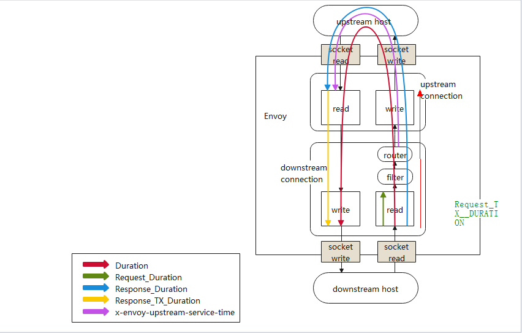

|     |                                     |                     |
| --- | ----------------------------------- | ------------------- |
| 1   | TimeToLastRxByte                    | REQUEST_DURATION    |
| 2   | TimeToFirstUpstreamTxByte           |                     |
| 3   | TimeToLastUpstreamTxByte            | REQUEST_TX_DURATION |
| 4   | TimeToFirstUpstreamRxByte           | RESPONSE_DURATION   |
| 5   | TimeToLastUpstreamRxByte            |                     |
| 6   | TimeToFirstDownstreamTxByte         |                     |
| 7   | TimeToLastDownstreamTxByte	Duration |                     |

RESPONSE_TX_DUATION = TimeToLastDownstreamTxByte-TimeToFirstUpstreamRxByte
X-ENVOY-UPSTREAM-SERVICE-TIME = TimeToFirstUpstreamRxByte - TimeToFirstUpstreamTxByte

