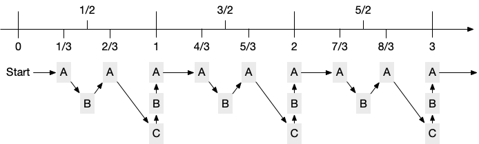

# EDF调度算法

原文链接：https://zablog.me/2019/08/02/2019-08-02/

最早截止时间优先调度法 Earliest Deadline First (EDF) scheduler

EDF调度算法，是加权轮转调度算法（WRR，Weighted Round-Robin）的一种实现方式。
其核心思想是为每个条目截止时间赋值为当前时间加权重的倒数，然后采用最早截止时间优先的方式进行调度。
上述定义比较晦涩，我们可以透过后面例子，来说明为什么需要调度算法、如何实现调度算法、EDF调度算法的优势和劣势。

# 算法实现

假设有三个条目可供调度，分别是A、B、C，他们的权重分别是3：2：1。
设置权重的目标是相关条目被调度到的频次应该是与权重成正比。
对于这个权重来说，假设有6000次调度，那么我们希望A被调度3000次左右，B是2000次左右，C是1000次左右。



最简单的实现，是使用上述办法模拟一个周期，然后把周期存到数组中，用游标扫描即可。
以上述情形为例，首先我们定制一个数组 A-B-A-C-B-A，然后不断回环扫描这个数组，就可以完成加权轮转调度。
这种方法的每次调度的时间复杂度为O(1)，空间复杂度为O(M*N)，其中M是条目的平均权重，N是条目的数量。
所有的条目信息必须要存储下来，因此对于存储空间来说，O(N)的内存消耗几乎不可避免，所以要想办法减少M带来的消耗。
由于 Weight > 0 且不可能等于 +♾，所以数轴上不会有单点出现多个同样的条目，所以从这个角度来看条目是可以复用的。
从这个思路出发，我们定义以下结构体。

```go
// Entry is an item for load balance
type Entry struct {
    deadline float64
    index    int64
    Value    string
    Weight   float64
}
```
初始时 entry.deadline = 1.0/entry.Weight
调度的时候，从中选择 deadline 最小的使用，并重新把这个条目放入优先队列中，并把 deadline 设置为 deadline + 1.0/entry.Weight，重新排布优先队列，如此往复。

source code from: https://github.com/pkumza/edf


# 其他思考
## index 的作用
当 deadline 一样的时候，index的作用才能显现出来。先加入的条目应该先出现，这样可以保证一定的稳定性。
否则，对于100个条目权重一模一样的调度来说，如果没有index的存在，那机会就变成随机调度了。
当weight不相同的时候，index也并非总是有效。
譬如 A 的 weight 为 3，C的 weight 为2 的时候，在第八轮，A有可能因deadline为精度问题比C早调度到。

## 存储优化
O(N)的内存消耗并非完全不可避免。
在 Service Mesh 场景下， control plane 对交给 proxy 的服务发现列表进行分片，可以使得每个 proxy 获得的条目数量减少。这种方式可以减少存储和Pick的时间消耗，同时还会有优化连接池等其他额外的优势。

## 起始随机Pick

新建一个EDF的时候，开始进行了一定的随机，为什么要这么做呢？
假设有一个条目的权重较大，那么不进行随机，第一次调度选举一定会调度到这个条目。
想象这样一个场景，分布式环境下所有的调度器由于某种问题同时重启，那么第一瞬间，所有的调度器都会调度到第一个条目，这很有可能造成第一个条目被瞬间的压力打挂。