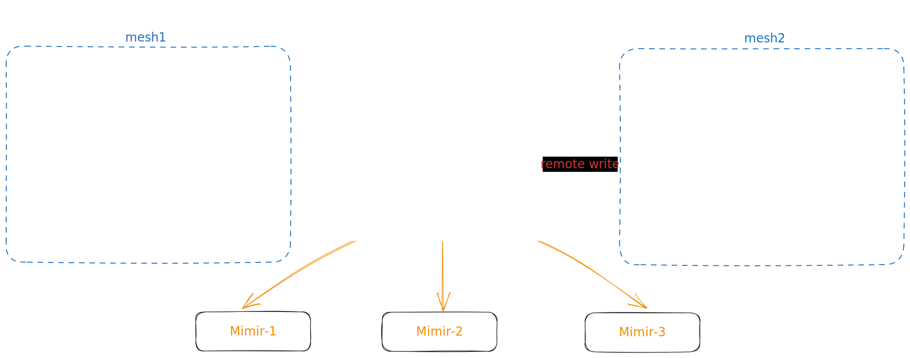

## Setup multi mesh with KinD

**This demo built on top of [play-with-grafana-mimir](https://grafana.com/tutorials/play-with-grafana-mimir/?pg=oss-mimir&plcmt=hero-btn-1)**





1. Create cluster with [KinD](https://kind.sigs.k8s.io/)

    ```shell
    CLUSTER_NAME=mesh1 ./create-cluster.sh
    CLUSTER_NAME=mesh2 ./create-cluster.sh
    ```
1. Install mesh with [Istioctl](https://istio.io/latest/docs/setup/install/istioctl/)

    ```shell
    istioctl install -f iop/mesh1.yaml -y --kubeconfig ~/.kube/kind-config-mesh1
    istioctl install -f iop/mesh2.yaml -y --kubeconfig ~/.kube/kind-config-mesh2
    ```

1. Install sample applications

    ```shell
    kubectl label namespace default istio-injection=enabled --overwrite --kubeconfig ~/.kube/kind-config-mesh1
    kubectl label namespace default istio-injection=enabled --overwrite --kubeconfig ~/.kube/kind-config-mesh2

    kubectl apply -f samples/ --kubeconfig ~/.kube/kind-config-mesh1
    kubectl apply -f samples/ --kubeconfig ~/.kube/kind-config-mesh2
    ```

1. Install [Grafana](https://grafana.com/oss/grafana/) and [Minir](https://grafana.com/oss/mimir/)

    ```shell
    docker-compose up -d
    ```

1. Install prometheus with remote write in each cluster

    ```shell
    helm template prometheus prometheus-community/prometheus --namespace istio-system \
      -f "prometheus/remote1-values.yml" | kubectl apply -f - --kubeconfig ~/.kube/kind-config-mesh1

    helm template prometheus prometheus-community/prometheus --namespace istio-system \
      -f "prometheus/remote2-values.yml" | kubectl apply -f - --kubeconfig ~/.kube/kind-config-mesh2
    ```