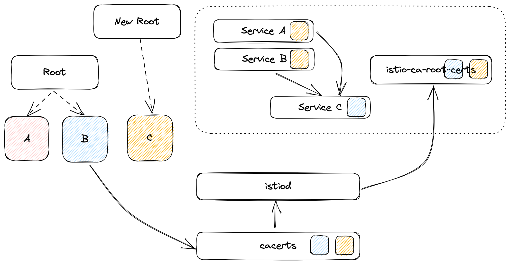

# Rotating certificates in Istio

Original Post: [Solo Hoot Live](https://www.youtube.com/watch?v=hD7L-haWJew) and [christianposta's post](https://blog.christianposta.com/diving-into-istio-1-6-certificate-rotation/)



## Generate Root Certs

1. Generate Root Certs A

```bash
make -f Makefile.selfsigned.mk root-ca
make -f Makefile.selfsigned.mk intermediateA-cacerts
make -f Makefile.selfsigned.mk intermediateB-cacerts

mkdir rootA

mv root-* rootA
mv intermediateA rootA
mv intermediateB rootA
```

## Installing Istio with RootA IntermediateA


1. Create cacerts

    ```bash
    kubectl delete secret cacerts -n istio-system --ignore-not-found && \
    kubectl create secret generic cacerts -n istio-system \
        --from-file=rootA/intermediateA/ca-cert.pem \
        --from-file=rootA/intermediateA/ca-key.pem \
        --from-file=rootA/intermediateA/root-cert.pem \
        --from-file=rootA/intermediateA/cert-chain.pem
    ```

1. Install istio

    ```bash
    istioctl install -y
    # verify ca root cert
    kubectl get cm istio-ca-root-cert -o jsonpath="{.data['root-cert\.pem']}" | step certificate inspect -
    ```

1. Verify Mesh traffic 
  
    ```bash
    kubectl exec -it deploy/sleep -- curl httpbin:8000/headers
    ```

## Update cacets with IntermediateB

1. Recreate cacert with IntermediateB

    ```bash
    kubectl delete secret cacerts -n istio-system  --ignore-not-found && \
    kubectl create secret generic cacerts -n istio-system \
        --from-file=rootA/intermediateB/ca-cert.pem \
        --from-file=rootA/intermediateB/ca-key.pem \
        --from-file=rootA/intermediateB/root-cert.pem \
        --from-file=rootA/intermediateB/cert-chain.pem
    ```

    verify ca root cert(Required [step](https://smallstep.com/docs/step-cli/#introduction-to-step) CLI)
    ```bash
    kubectl get cm istio-ca-root-cert -o jsonpath="{.data['root-cert\.pem']}" | step certificate inspect -
    ```

1. Verify istiod's log

    ```bash
    kubectl logs -l app=istiod -nistio-system --tail=-1 | grep "x509 cert - Issuer"
    ```

1. Rollout deployment

    ```bash
    kubectl rollout restart deploy/istiod -n istio-system
    kubectl rollout restart deploy/httpbin
    ```

## Update Cacerts with Combined Root

1. Create new root cert

    ```bash
    make -f Makefile.selfsigned.mk root-ca
    make -f Makefile.selfsigned.mk intermediateC-cacerts

    mkdir rootB

    mv root-* rootB
    rm -rf rootB/intermediateC
    mv intermediateC rootB
    ```

1. Combine two root certs into `combined-root.pem`

    ```bash
    cat rootA/root-cert.pem > combined-root.pem
    cat rootB/root-cert.pem >> combined-root.pem
    ```

1. RootA IntermediateB with `combined-root.pem`

    ```bash
    kubectl delete secret cacerts -n istio-system --ignore-not-found && \
    kubectl create secret generic cacerts -n istio-system \
        --from-file=rootA/intermediateB/ca-cert.pem \
        --from-file=rootA/intermediateB/ca-key.pem \
        --from-file=root-cert.pem=combined-root.pem \
        --from-file=rootA/intermediateB/cert-chain.pem
    ```
    
    [Verify traffic](#how-verify-traffic)

1. RootB IntermediateC with `combined-root.pem`

    ```bash
    kubectl delete secret cacerts -n istio-system --ignore-not-found && \
    kubectl create secret generic cacerts -n istio-system \
        --from-file=rootB/intermediateC/ca-cert.pem \
        --from-file=rootB/intermediateC/ca-key.pem \
        --from-file=root-cert.pem=combined-root.pem \
        --from-file=rootB/intermediateC/cert-chain.pem
    ```
    
    [Verify traffic](#how-verify-traffic)

1. RootB only

    ```bash
    kubectl delete secret cacerts -n istio-system --ignore-not-found && \
    kubectl create secret generic cacerts -n istio-system \
        --from-file=rootB/intermediateC/ca-cert.pem \
        --from-file=rootB/intermediateC/ca-key.pem \
        --from-file=rootB/intermediateC/root-cert.pem \
        --from-file=rootB/intermediateC/cert-chain.pem
    ```

    [Verify traffic](#how-verify-traffic)

## How verify traffic

1. Rollout istiod

    ```bash
    kubectl rollout restart deploy/istiod -n istio-system
    ```

    ```bash
    kubectl exec -it deploy/sleep -- curl httpbin:8000/headers
    ```

1. Rollout httpbin

    ```bash
    kubectl rollout restart deploy/httpbin
    ```

    ```bash
    kubectl exec -it deploy/sleep -- curl httpbin:8000/headers
    ```

1. Rollout sleep

    ```bash
    kubectl rollout restart deploy/sleep
    ```

    ```bash
    kubectl exec -it deploy/sleep -- curl httpbin:8000/headers
    ```
