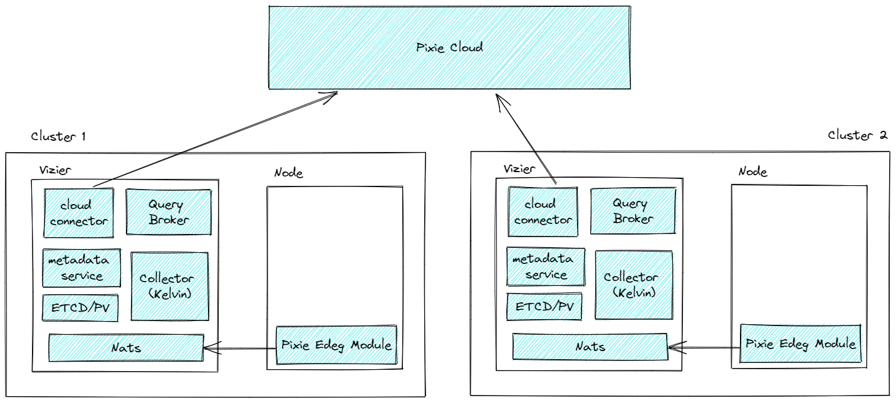

# Pixie vs Tetragon

## Pixie 

Pixie is an open-source observability tool for Kubernetes applications. Use Pixie to view the high-level state of your cluster (service maps, cluster resources, application traffic) and also drill down into more detailed views (pod state, flame graphs, individual full-body application requests).

### Features

- Auto-telemetry

Pixie uses eBPF to automatically collect telemetry data such as full-body requests, resource and network metrics, application profiles, and more.

- In-Cluster Edge Compute

Pixie collects, stores and queries all telemetry data locally in the cluster. Pixie uses less than 5% of cluster CPU and in most cases less than 2%.

- Scriptability

PxL, Pixie’s flexible Pythonic query language, can be used across Pixie’s UI, CLI, and client APIs.

### Use Cases

#### Network Monitoring

Use Pixie to monitor your network, including:

1. The flow of network traffic within your cluster.
1. The flow of DNS requests within your cluster.
1. Individual full-body DNS requests and responses.
1. Map of TCP drops and TCP retransmits across your cluster.

#### Infrastructure Health

Monitor your infrastructure alongside your network and application layer, including:

1. Resource usage by Pod, Node, Namespace.
1. CPU flame graphs per Pod, Node.

#### Service Performance

Pixie automatically traces a variety of protocols(HTTP, HTTP2, DNS, NATS, Kafka etc).

1. The flow of traffic between your services.
1. Latency per service and endpoint.
1. Sample of the slowest requests for an individual service.

#### Database Query Profiling

Pixie automatically traces several different database protocols(MySQL, PostgreSQL, Cassandra, Redis etc).

1. Latency, error, and throughput (LET) rate for all pods.
1. LET rate per normalized query.
1. Latency per individual full-body query.
1. Individual full-body requests and responses.

#### Request Tracing

Pixie makes debugging this communication between microservices easy by providing immediate and deep (full-body) visibility into requests flowing through your cluster. 

#### Continuous Application Profiling

Use Pixie's continuous profiling feature to identify performance issues within application code.

#### Dynamic Go Logging

Debug Go binaries deployed in production environments without needing to recompile and redeploy.

## Tetragon

Cilium’s new Tetragon component enables powerful realtime, eBPF-based Security Observability and Runtime Enforcement.

Tetragon detects and is able to react to security-significant events, such as

1. Process execution events
1. System call activity
1. I/O activity including network & file access

## Features

1. eBPF Real-Time

Tetragon is a runtime security enforcement and observability tool. What this means is Tetragon applies policy and filtering directly in eBPF in the kernel. It performs the filtering, blocking, and reacting to events directly in the kernel instead of sending events to a user space agent.

1. eBPF Flexibility

Tetragon can hook into any function in the Linux kernel and filter on its arguments, return value, associated metadata that Tetragon collects about processes (e.g., executable names), files, and other properties. By writing tracing policies users can solve various security and observability use cases. 

1. eBPF Kernel Aware

Tetragon, through eBPF, has access to the Linux kernel state. Tetragon can then join this kernel state with Kubernetes awareness or user policy to create rules enforced by the kernel in real time.

## Use Cases

1. Process Execution

1. File Access

1. Network Observability

1. Privileged Execution

## Sumary

1. Pixie 主要关注服务拓扑，请求流量以及集群资源等方面的可观测性；Tetragon 作为 Cilium Hubble 的补充主要关注安全与运行时。
2. Pixie Cloud 支持多集群，目前无法将多集群数据聚合展示；Tetragon 与 Hubble 目前都不支持多集群。
3. Pixie 支持访问方式有CLI、API、Live UI，Tetragon目前支持CLI观测，且暂未与Hubble集成。
4. Pixie 可与 Grafana DataSource，Tetragon目前日志输出在stdout需要通过fluentd与ELK集成。
5. Pixie 目前只保存24小时数据，持久化存储需要通过插件实现，Tetragon 需要用户实现。
6. Pixie 与 Tetragon 都未提到与 VM 集成。
